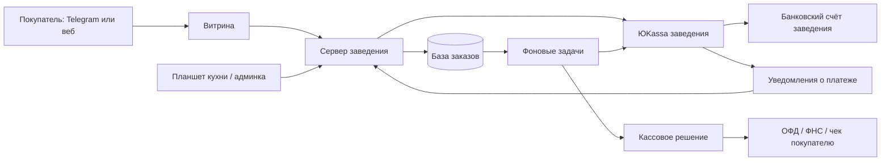

# 2. Вся логика: заказ, деньги, чек и выдача

## Из чего состоит система

Схема — целевой проект. Сейчас в коде есть витрина, HTTP-сервер, SQLite и адаптер ЮKassa. Надёжного обработчика фоновых задач и полного кассового цикла ещё нет. Канал фискализации выбирается один: через поддерживаемое решение ЮKassa или через согласованную кассу/POS; нельзя бездумно пробивать один и тот же расчёт в обоих местах.

Фронтенд показывает данные и отправляет намерение. Бэкенд — серверная часть — проверяет, разрешено ли действие, рассчитывает цену и фиксирует результат. База — долговременная память. API — согласованный способ общения программ. Webhook — уведомление от другого сервиса. Worker — процесс, который выполняет сохранённые фоновые задачи даже после закрытия телефона.

## Обычный путь покупателя

1. Открывает приложение. Сервер проверяет подпись Telegram, а не верит присланному имени или ID.
2. Выбирает точку, если их несколько, и видит её график, доступное меню, время ожидания и способ получения.
3. Выбирает блюда, размеры, добавки. Сервер проверяет совместимость, ограничения и наличие.
4. Сервер создаёт снимок заказа: названия, состав, цены в копейках, продавец, точка, налоговые параметры. Если завтра поменять меню, вчерашний заказ не изменится.
5. Появляется ограниченный по времени заказ на оплату. Проверяются доступность кухни и возможность приготовить его в выбранный слот.
6. Оплата открывается на странице провайдера; реквизиты карты не проходят через наш сервер.
7. Сервер получает подтверждение и независимо проверяет платёж у провайдера. В браузере «успех» ещё не означает подтверждённые деньги.
8. Оплаченный заказ появляется на кухне. Сотрудник подтверждает, что увидел его; затем начинает готовить.
9. Покупатель видит статус. «Готов» выставляет кухня, а не таймер на телефоне.
10. При выдаче сотрудник проверяет номер, состав и одноразовый код. Сервер атомарно фиксирует выдачу: две параллельные попытки не могут обе завершиться успешно.
11. Кассовый сценарий закрывается в соответствии с выбранной схемой. Сверка убеждается, что заказ, деньги и чеки согласованы.

Приложение может быть доступно ночью, но принимать заказ только в часы кухни. «Работает 24/7» не означает «заведение обязано готовить 24/7».

## Не смешивать четыре разных состояния

| Что отслеживаем | Пример состояний | Почему отдельно |
|---|---|---|
| Заказ | Новый → принят → готовится → готов → выдан; отдельно отменён | Показывает работу кухни |
| Платёж | Создаётся → ожидает оплаты → подтверждён; отдельно отменён/неизвестен | Банк может задержать ответ |
| Возврат | Запрошен → обрабатывается → подтверждён/ошибка; частичный/полный | Возврат занимает время и не равен отмене заказа |
| Чек | Нужен → отправлен → зарегистрирован/ошибка | Деньги могут пройти, а фискализация — задержаться |

В нынешнем коде эти понятия частично смешаны в `status` и `paid`. Для коммерческой версии это требуется разделить. Финансовую историю не удаляют вместе с карточкой заказа: срок хранения и объём данных определяют отдельно.

## Какие данные понадобятся

- `merchants`: продавец, его реквизиты и профиль интеграций.
- `locations`: точки, часовой пояс, график, перерывы, вместимость слотов.
- `staff`, `roles`: сотрудники, права, блокировка, сессии.
- `products`, `variants`, `modifier_groups`: товары, размеры, доступные добавки, ограничения «выбрать 1 соус».
- `orders`, `order_items`: номер, покупатель, снимок состава/цен, состояние приготовления.
- `payments`, `payment_attempts`: ID провайдера, суммы, валюта, ключи повторных запросов, подтверждения.
- `refunds`, `receipts`: возвраты и фискальные документы с отдельными статусами.
- `events`, `jobs`: полученные события и работа, которую нужно завершить после перезапуска.
- `audit_log`: кто изменил цену, отменил заказ, сделал возврат, выдал заказ или выдал себе права.

Для первой отдельной установки достаточно одного продавца. Сеть может иметь несколько юридических лиц: связь точки с продавцом и магазином оплаты должна быть явной. Нельзя определять продавца только по названию бренда.

## Цена и наличие

Текущий пример: классическая 290 ₽ + XL 90 ₽ + сыр 50 ₽ + морковь 35 ₽ = 465 ₽, две штуки = 930 ₽. Клиент может прислать `total: 1`, но сервер всё равно должен получить 930 ₽.

Деньги в новой модели храним целым числом копеек. Десятичную строку для ЮKassa формируем только на границе API. Проверяем суммы скидок, частичных возвратов и чековых строк без ошибок округления.

Заказ на оплату имеет срок жизни. При оплате проверяем резерв блюда/слота или заранее согласованную политику отказа и возврата. Нельзя сегодня создать заказ, через неделю оплатить старую цену, когда точка закрыта, и автоматически считать это нормальным заказом.

Резерв — это запись в базе, а не выключенная кнопка. Две покупки последней порции нужно проверять одновременно в транзакции — операции базы, которая выполняется целиком или не выполняется вовсе.

## Повторы, обрывы связи и «деньги списались, заказа нет»

Идемпотентность означает: повтор одного и того же действия не создаёт второй результат. На одно намерение оплаты сохраняем ключ, привязанный к неизменному содержимому запроса. Повтор не должен ни создавать второе списание, ни незаметно принимать другую корзину под старым ключом.

Ключ провайдера не является вечной страховкой. ЮKassa гарантирует идемпотентность в течение 24 часов после первого запроса; позже такой запрос может обрабатываться как новый. Поэтому сохраняем собственную историю попыток; после неопределённого результата сначала выясняем состояние платежа. [Формат взаимодействия с API](https://yookassa.ru/developers/using-api/interaction-format).

Приём webhook в целевой версии:

1. Проверить формат, ограничить размер и частоту.
2. Надёжно сохранить событие/задание, не зависеть от последних заказов в интерфейсе.
3. Запросить объект платежа по серверному API и сверить магазин, заказ, сумму, валюту, среду и статус.
4. В транзакции применить разрешённое изменение. Повтор уведомления — безопасный повтор.
5. Создать в той же транзакции задачи кухни/чека/уведомления, чтобы они не потерялись между записью оплаты и падением процесса.
6. Вернуть успешный ответ после долговременного принятия события. Ошибки обрабатывать так, чтобы возможны были повторы.

У провайдера есть конечный период повторной доставки. Поэтому нужен независимый процесс сверки ожидающих платежей и финансовых итогов; один webhook не является единственной гарантией. [ЮKassa об уведомлениях](https://yookassa.ru/developers/using-api/webhooks).

Сверка — регулярное сравнение нашей базы с провайдером: ожидающие оплаты, подтверждённые суммы, возвраты, ошибки чеков. Несоответствие попадает в очередь разбора с ответственным. Покупателю при неопределённости показываем «проверяем оплату», а не предлагаем немедленно заплатить второй раз.

## Списывать сразу или сначала резервировать деньги?

Для первого пилота проще одностадийная оплата: деньги подтверждаются сразу, а оплаченный заказ должен быть приготовлен или возвращён по определённой процедуре. Это требует проверки открытой кухни и ограничений до оплаты.

Двухстадийный платёж сначала резервирует деньги, а после принятия заказа выполняется подтверждение списания. Он может уменьшить число возвратов при отказах кухни, но зависит от способа оплаты и срока удержания. Нельзя без проверки провайдера считать его доступным всегда. Выбор согласуется с конкретной точкой и провайдером.

## Чеки: отдельная интеграция

Уведомление банка, квитанция эквайринга и экран «оплачено» не заменяют фискальный чек. Для ИП/ООО выбирают кассовое решение, для НПД — формирование чека дохода в установленной для него системе. [ЮKassa о чеках](https://yookassa.ru/developers/payment-acceptance/receipts/basics).

Нельзя автоматически переносить правила кассы в зале на дистанционный заказ. Официальные разъяснения ФНС рассматривают разные случаи: предварительную оплату, доставку, расчёт при личном взаимодействии. Для нашего самовывоза до получения блюда нужно письменно зафиксировать согласованный сценарий: какие чеки, в какой момент, кто формирует чек зачёта при необходимости, как оформляется возврат. Источники: [предоплата](https://www.nalog.gov.ru/rn92/news/activities_fts/16621080/), [дистанционная оплата и другие сценарии](https://www.nalog.gov.ru/rn93/news/activities_fts/16618680/).

Настраиваются ставка НДС, система налогообложения, предмет и способ расчёта, данные продавца, интернет-реквизиты, контакт покупателя и правила маркировки, если такие товары есть. «Без НДС» и ставка 0% — разные значения. Эти параметры не определяются разработчиком по внешнему виду заведения.

После возврата денег может требоваться соответствующий чек. Ошибка чекового сервиса должна попасть в мониторинг и очередь повторов/ручного разбора, а не исчезнуть из логов.

## Самозанятость — отдельный вариант

У НПД есть ограничения, в частности по наёмным работникам по трудовым договорам, годовому доходу и перепродаже. Собственная продукция и перепродажа покупных напитков — разные ситуации. Применимость для конкретного заведения проверяет его бухгалтер. [ФНС о НПД](https://npd.nalog.ru/).

В текущей документации ЮKassa указано, что отправка чеков самозанятых через неё недоступна; в истории API зафиксировано прекращение соответствующих сервисов с 29.12.2025. Это не означает, что приём платежей для самозанятых вообще запрещён; нельзя обещать прежнюю автоматизацию чеков. Нужен отдельный подтверждённый способ выдачи чеков НПД и возвратов. [История API](https://yookassa.ru/developers/using-api/changelog).

## Выдача и спорные случаи

Шестизначный код подтверждает владение заказом. Он не устанавливает паспортную личность; покупатель может передать получение другу. QR-код — лишь более удобное представление секрета и также проверяется сервером. Анимированный экран не заменяет серверную проверку.

Целевая реализация: номер заказа + секрет, ограничение попыток на заказ/сотрудника, хранение защищённого значения, одноразовая атомарная выдача, запись сотрудника и времени. Код не попадает в журналы и аналитику. Два сотрудника, нажавших «выдать», не могут оба завершить выдачу.

Потерян телефон: руководитель смены использует согласованный процесс восстановления с проверкой подтверждающих данных и записью причины. Сотрудник не обходит код просто потому, что покупатель назвал сумму. При споре об оплате проверяют провайдера, а не скриншот банка.

При отсутствии сети нельзя надёжно узнать, был ли код уже использован. Офлайн-выдача — осознанная политика риска заведения, а не автоматический безопасный режим. Нужен отдельный журнал и последующая сверка.

## Связь с POS-системой

POS — существующая кассовая/учётная система заведения; например, она может уже вести меню, кухню и чеки. До разработки выясни её название, версию, наличие API и стоимость доступа.

Нужно выбрать, кто является главным источником меню, остатков и статусов. Если заказы отправляются и в наш планшет, и в POS, нужны внешние ID, подтверждения и защита от повторов. Нельзя дважды отправить блюдо на кухню или дважды пробить чек. Интеграция с конкретным POS — отдельная работа, не выполненная в текущем прототипе.
