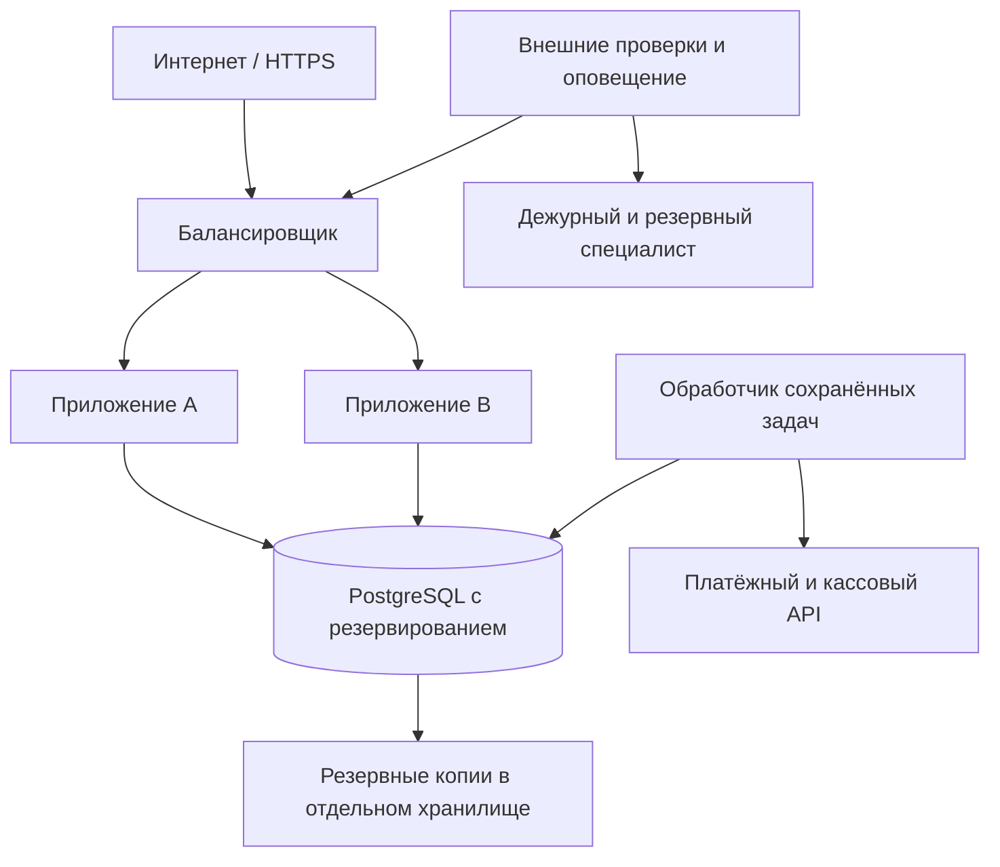

# 4. Круглосуточная работа и обслуживание

## Что означает 24/7

Сервис должен работать без запущенного компьютера разработчика, автоматически переживать ожидаемые сбои и иметь ответственных за неожиданные. Это не обещание нулевого простоя.

- **SLI** — измерение, например доля успешно обработанных запросов оформления заказа.
- **SLO** — внутренняя цель надёжности.
- **SLA** — обязательство перед клиентом с согласованным способом измерения и последствиями нарушения.
- **RPO** — сколько недавно записанных данных допустимо потерять при восстановлении.
- **RTO** — за какое время нужно восстановить функцию после аварии.

Для ориентира: в 30-дневном месяце 99,9% доступности оставляют около 43 минут 12 секунд простоя; 99,95% — 21 минуту 36 секунд. Это арифметика, не текущая характеристика КРУТИ. Нельзя писать такой SLA в договоре, пока инфраструктура, мониторинг и люди его не подтверждают.

Отдельно определяют доступность витрины, оформления/оплаты и админки. Если страница открывается, но оформить заказ нельзя, считать всё работоспособным нечестно. Зависимости Telegram, провайдера оплаты и интернета заведения тоже влияют на опыт покупателя; договор должен прозрачно описывать методику и исключения.

## Предлагаемая инфраструктура

Для коммерческого варианта с повышенной доступностью:

Основная база, копии и обработка чувствительных данных — в согласованном российском контуре. В качестве конкретного кандидата для расчёта можно рассмотреть управляемый PostgreSQL с резервированием в российском облаке; у Yandex Cloud документированы [отказоустойчивость](https://yandex.cloud/ru/docs/managed-postgresql/concepts/high-availability) и [резервные копии](https://yandex.cloud/ru/docs/managed-postgresql/concepts/backup). Это пример технологии, а не выбор оплаченного тарифа или обещание SLA.

Управляемая БД означает, что часть обслуживания выполняет провайдер. Конфигурация, доступы, корректность запросов, восстановление приложения и проверка копий всё равно остаются твоей ответственностью в рамках договора.

Для недорогого ограниченного пилота возможен один экземпляр приложения с автоперезапуском и восстановлением. Но это единая точка отказа: его нельзя продавать как ту же отказоустойчивость, что у нескольких независимых экземпляров. Уровень надёжности выбирают вместе с бюджетом и допустимым ущербом.

Для первой версии достаточно одного модульного серверного приложения и отдельного worker из того же кода. Очередь задач может храниться в PostgreSQL; отдельные Redis/Kafka не обязательны. Для нескольких работников нужны блокировки/аренда задач в базе, безопасные повторы и ограничение числа попыток.

## Установка, которую можно повторить

1. Зафиксированный релиз с контрольной суммой/идентификатором образа, файл зависимостей и инструкции сборки.
2. Отдельные конфигурация и секреты каждого клиента, доступ к ним по ролям.
3. Создание базы из миграций и проверка совместимости старой/новой схемы.
4. HTTPS, автоматическое продление сертификата, ограниченный сетевой доступ к базе.
5. Liveness показывает, жив ли процесс; readiness — способен ли он обслуживать запросы. Недоступный worker проверяется отдельно.
6. Сервисный менеджер/платформа перезапускает упавший процесс. Нельзя полагаться на открытый терминал или команду `npm start` вручную.
7. Staging использует тестовый магазин и синтетические данные. Боевые ключи и база туда не копируются.
8. Релиз проходит проверки, резервное копирование и согласованное окно. Для обратной несовместимости БД существует отдельный план, а не только возврат старого кода.

## Что наблюдать

| Сигнал | Зачем | Пример действия |
|---|---|---|
| Внешняя проверка витрины и API | Процесс может быть «жив», а сайт недоступен | Оповестить дежурного при подтверждённом сбое |
| Ошибки checkout, задержка API | Покупатели не могут заказать | Проверить релиз, БД, лимиты и провайдера |
| Оплаченный заказ не принят кухней | Деньги есть, заказ никто не готовит | Сигнал смене; затем управляющему; возможна автопауза |
| Возраст последнего heartbeat кухни | Планшет уснул/нет интернета | Не показывать старый список как актуальный |
| Возраст ожидающего платежа и размер очереди | Застряла сверка/worker | Разбор и повтор безопасной задачи |
| Расхождение денег/возвратов/заказов | Денежная ошибка | Блокировать рискованные повторы, поднять инцидент |
| Ошибка или задержка фискализации | Оплата не закрыла обязательства по чеку | Оповестить ответственного и кассового провайдера |
| Последняя успешная копия и восстановление | Наличие backup-файла не доказывает его полезность | Исправить задачу и проверить восстановление |
| Свободный диск, БД, CPU, RAM, соединения | Предупреждает остановку | Исправить утечку/лимит, масштабировать по измерениям |
| Сертификат, домен, баланс облака | Сервис может отключиться без ошибки кода | Предупредить владельца заранее |

Порог, например «заказ не принят 2 минуты», — предлагаемая бизнес-настройка, которую согласуют с точкой. Не нужно отправлять сотни одинаковых сообщений: важны объединение событий, подтверждение получения и эскалация второму человеку.

Логи содержат время, безопасный ID заказа/запроса, операцию, результат и код ошибки. Не содержат ключи, коды выдачи, cookies, полные initData, карточные данные. Email, комментарии и сведения о покупателях не пересылают в иностранный лог-сервис по умолчанию.

## Резервирование и восстановление

Реплика помогает продолжить работу при отказе узла, но обычно повторяет ошибочное удаление. Backup нужен отдельно. Копия на том же диске, который защищаем, не считается достаточным планом.

Предлагаемые цели пилота для обсуждения: восстановление сервиса за час и технический RPO до 5 минут при подходящей конфигурации. Это не измеренные результаты. Для подтверждённых денежных событий цель — отсутствие неразобранных потерь: после аварии их восстанавливают и сверяют с провайдером. Провайдер хранит платёж, но не обязан хранить полный состав заказа, поэтому одной сверки недостаточно.

Порядок:

1. Автоматические копии по расписанию, при необходимости восстановление на момент времени (PITR), отдельная копия перед рискованной миграцией.
2. Шифрование, отдельные права и доступный клиенту ключ восстановления.
3. Уведомление о провале копирования.
4. Регулярное восстановление в изолированной среде: не отправлять оттуда реальные чеки, сообщения и платежи.
5. Проверить составы заказов, суммы, миграции, ключевые права; зафиксировать время восстановления.
6. Перед возвратом в работу — сверить платежи/возвраты, исключить повторную выдачу и повторное выполнение фоновых действий.

Сроки хранения рабочих данных и копий нужно определить отдельно с учётом целей и обязательств. Не обещать «удалим абсолютно всё мгновенно», если есть законные требования хранения финансовых документов.

## Инструкция при аварии

| Ситуация | Действия |
|---|---|
| Деньги списались, заказ не виден | Найти платёж у провайдера, сверить магазин/сумму/заказ; восстановить связь и состояние; не просить сразу платить повторно; при невозможности исполнения — возврат по процедуре |
| ЮKassa недоступна | Показывать ошибку/проверку состояния; не создавать бесконечные попытки; сохранить корзину; использовать только заранее согласованный запасной способ заказа |
| Кухня потеряла связь | Заметный offline-статус, связь с сотрудником, пауза приёма по политике; оплаченные заказы разобрать отдельно |
| Приложение падает после релиза | Приостановить рискованные операции, откатить совместимый релиз, проверить БД и очередь, сверить финансы |
| Закончился диск | Сохранить доказательства/состояние, остановить небезопасные записи, освободить только разрешённые технические файлы или расширить диск; не удалять заказы «для скорости» |
| База недоступна | Не выдавать случайные успешные ответы, переключиться по плану, проверить целостность и сверить события |
| Утёк токен | Отозвать/заменить ключ у владельца, остановить утечку, сохранить журнал, оценить затронутые операции, уведомить ответственных по процедуре |
| Telegram недоступен | Согласованный резервный веб-канал/касса; полноценный веб-заказ требует отдельной аутентификации и уже должен быть реализован и проверен |

Зафиксировать начало, затронутую функцию, временное решение, финансовое влияние, восстановление и профилактику. После серьёзной аварии нужен короткий разбор причин и исправление.

**Ты один не можешь гарантировать круглосуточную человеческую реакцию.** Для такой услуги нужен сменный/резервный специалист или договор с поддержкой, которая действительно обслуживает нужные компоненты. Доступность серверов, часы твоей поддержки и скорость реакции — три разных пункта договора.

## Персональные данные и размещение

Telegram ID, контакт для чека и заказ в связке с покупателем нельзя автоматически считать обезличенными. Сделать только российскую основную таблицу недостаточно, если данные без разбора уходят в логи, аналитику, резервные копии и сторонние интеграции.

До запуска составить карту: какие сведения собираются, зачем, где обрабатываются, кому передаются и сколько хранятся. При обычной схеме заведение определяет цели обработки данных покупателей; подрядчик получает конкретное поручение. Если ты сам начинаешь использовать данные для своих целей, роль и обязанности могут измениться. [Ст. 6](https://www.consultant.ru/document/cons_doc_LAW_61801/315f051396c88f1e4f827ba3f2ae313d999a1873/).

Проверить уведомление Роскомнадзора с учётом применимых исключений, публичную политику, основания обработки, процедуры обращений и инцидентов. Отдельно оценить трансграничные передачи, в том числе архитектуру Telegram. Согласие на рекламную рассылку не подменять оформлением заказа и не включать заранее. [Ст. 22 об уведомлении](https://www.consultant.ru/document/cons_doc_LAW_61801/d996966e22e1320c9de1ab82d9f6be12c3d9d765/), [разъяснение Минцифры о локализации и трансграничной передаче](https://www.consultant.ru/document/cons_doc_LAW_511584/).

Это список вопросов для проектирования и проверки специалистом по российскому праву, не готовое юридическое заключение о соответствии конкретной установки. Размещение в РФ — необходимая часть предлагаемой схемы, но само по себе не сертификат соответствия.

## Бюджет и цена сопровождения

Сначала получить актуальные предложения провайдеров. В смету включить: приложение, БД, резервирование, хранилище/копии, домен, мониторинг, тестовую среду, кассовое решение, комиссию платежей, SMS при необходимости, поддержку и налоги. Не скрывать расходы на POS API и дополнительные точки.

Условная арифметика, **не рыночный тариф**: если инфраструктура стоит 6 000 ₽/месяц, сопровождение занимает 2 часа по внутренней стоимости 1 500 ₽ и ещё 1 000 ₽ резервируется на внеплановые работы, себестоимость уже 10 000 ₽ до части налогов и прибыли. Продажа такой услуги за 5 000 ₽ убыточна даже без аварии.

Нагрузку оценивают числом одновременных покупателей, пиковыми заказами в минуту, числом точек и допустимым временем ответа. Тариф подбирается по измерениям. До выбора этих параметров точная цена «всего 24/7» будет выдумкой.
